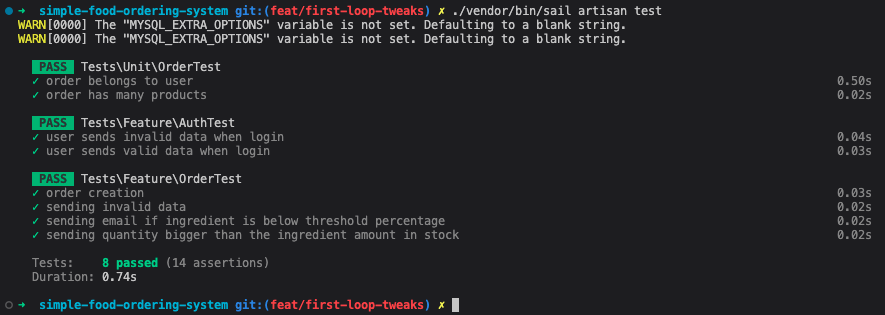
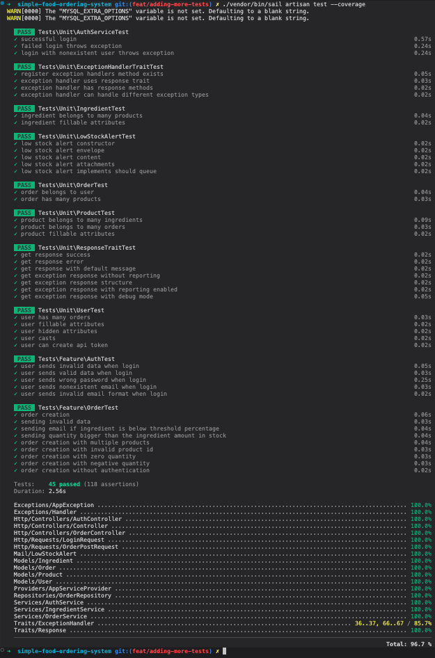
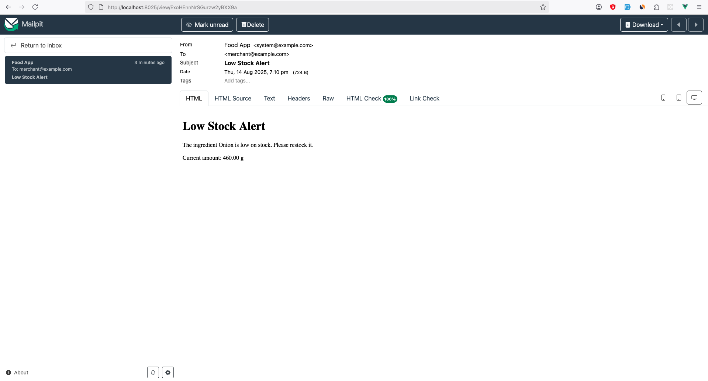

# Simple Food Ordering System

A Laravel-based food ordering system that manages products, ingredients, orders, and automatically sends low stock alerts when ingredients fall below a configurable threshold.

## Features

- **User Authentication**: Secure login system with Laravel Sanctum
- **Product Management**: Create and manage products with ingredients
- **Ingredient Management**: Track ingredient stock levels with automatic alerts
- **Order Processing**: Create orders with multiple products
- **Stock Management**: Automatic stock deduction and low stock alerts
- **Email Notifications**: Queued email alerts for low stock ingredients
- **API-First Design**: RESTful API endpoints for all operations

## Note Before heading to the below sections:

You can run the app by using **docker** (using Laravel Sail):

  ```bash
  ./vendor/bin/sail up
  ```
 and then you can use artisan commands like this:

  ```bash
  ./vendor/bin/sail artisan ...
  ```

## Prerequisites

- PHP 8.1 or higher
- Composer
- MySQL/PostgreSQL/SQLite

## Installation & Setup

1. **Clone the repository**
   ```bash
   git clone <repository-url>
   cd simple-food-ordering-system
   ```

2. **Install PHP dependencies**
   ```bash
   composer install
   ```

3. **Environment setup**
   ```bash
   cp .env.example .env
   php artisan key:generate
   ```

4. **Configure your database in `.env`**
   ```env
   DB_CONNECTION=mysql
   DB_HOST=127.0.0.1
   DB_PORT=3306
   DB_DATABASE=your_database_name
   DB_USERNAME=your_username
   DB_PASSWORD=your_password
   
   # Optional: Configure stock threshold percentage (default: 50)
   STOCK_THRESHOLD_PERCENTAGE=50
   
   # Optaionl (Mailpit, if you are going to use Laravel Sail): Configure mail settings for low stock alerts
   MAIL_MAILER=smtp
   MAIL_HOST=your_smtp_host
   MAIL_PORT=587
   MAIL_USERNAME=your_email
   MAIL_PASSWORD=your_password
   MAIL_ENCRYPTION=tls
   MAIL_FROM_ADDRESS=your_email
   MAIL_FROM_NAME="${APP_NAME}"
   ```

5. **Run database migrations and seed it with sample data**
   ```bash
   php artisan migrate:refresh --seed
   ```

6. **Start the development server**
   ```bash
   php artisan serve
   ```

7. **Run queue workers**
   ```bash
   php artisan queue:work
   ```

### Base URL
```
http://localhost:8080/api/v1
```

* You can view the API docs from [here](https://documenter.getpostman.com/view/6359426/2sB3BHjnxW)

* Also you can import `simple_food_ordering_system.postman_collection.json` in postman (note that after login, no need to copy the `token` as it will be set automatically due to the Post-response script that I have added).

### Authentication
All API endpoints require authentication using Laravel Sanctum. Include the Bearer token in the Authorization header:
```
Authorization: Bearer {your_token}
```

### API Endpoints

#### 1. Authentication

**POST /login**
- **Description**: Authenticate user and get access token
- **Request Body**:
  ```json
  {
    "email": "customer@example.com",
    "password": "123456"
  }
  ```

#### 2. Orders

**POST /orders**
- **Description**: Create a new order
- **Request Body**:
  ```json
  {
    "products": [
      {
        "product_id": 1,
        "quantity": 2
      },
      {
        "product_id": 2,
        "quantity": 1
      }
    ]
  }
  ```

### API Response Format

The API uses a consistent response format for both success and error responses:

#### Success Response Format
```json
{
  "is_success": true,
  "status_code": 200,
  "message": "Operation completed successfully",
  "data": {
    // Response data here
  }
}
```

#### Error Response Format
```json
{
  "is_success": false,
  "status_code": 422,
  "message": "Operation failed.",
  "errors": {
    // List of errors, like validation errors
  }
}
```

### Example Responses

#### Successful Response
```json
{
  "is_success": true,
  "status_code": 201,
  "message": "Order created successfully",
  "data": {
    "id": 1,
    "total_amount": 800,
    "created_at": "2025-08-14T10:30:00.000000Z",
    "updated_at": "2025-08-14T10:30:00.000000Z",
    "products": [
      {
        "id": 1,
        "name": "Burger"
      }
    ]
  }
}
```

#### Error Response
```json
{
  "is_success": false,
  "status_code": 422,
  "message": "The given data was invalid.",
  "errors": [
    {
        "field": "products.0.product_id",
        "message": "The products.0.product_id field is required."
    },
    {
        "field": "products.0.quantity",
        "message": "The products.0.quantity field is required."
    }
  ]
}
```

#### Business Logic Error Response
```json
{
  "is_success": false,
  "status_code": 422,
  "message": "Not enough ingredients for Burger(Beef is out of stock)",
  "errors": []
}
```

#### Authentication Error Response
```json
{
  "is_success": false,
  "status_code": 401,
  "message": "Unauthenticated.",
  "errors": {}
}
```

## Testing

### Running Tests

1. **Run all tests**
   ```bash
   php artisan test
   ```



2. **Run tests with coverage (requires Xdebug)**
   ```bash
   php artisan test --coverage
   ```
   **FYI:** current test coverage is **96.7%** as in the below screenshot.



## Low Stock Alert System

The system automatically monitors ingredient stock levels and sends email alerts when ingredients fall below the configured threshold percentage (default: 50%).

### How it Works

1. When an order is placed, the system deducts the required ingredients from stock
2. If any ingredient's current amount falls below the threshold percentage of its total amount, a low stock alert email is queued
3. The email is sent to the configured merchant email address
4. The system prevents duplicate alerts by tracking the `is_low_amount_alert_email_sent` flag

### Low Stock Alert Email



## Improvements
One of the main improvements if I would to spend more time on the project is using the [API Resources](https://laravel.com/docs/12.x/eloquent-resources) in creating the order response, in addition to that make the time complexity in `IngredientService -> updateStock` to be `O(n)`.